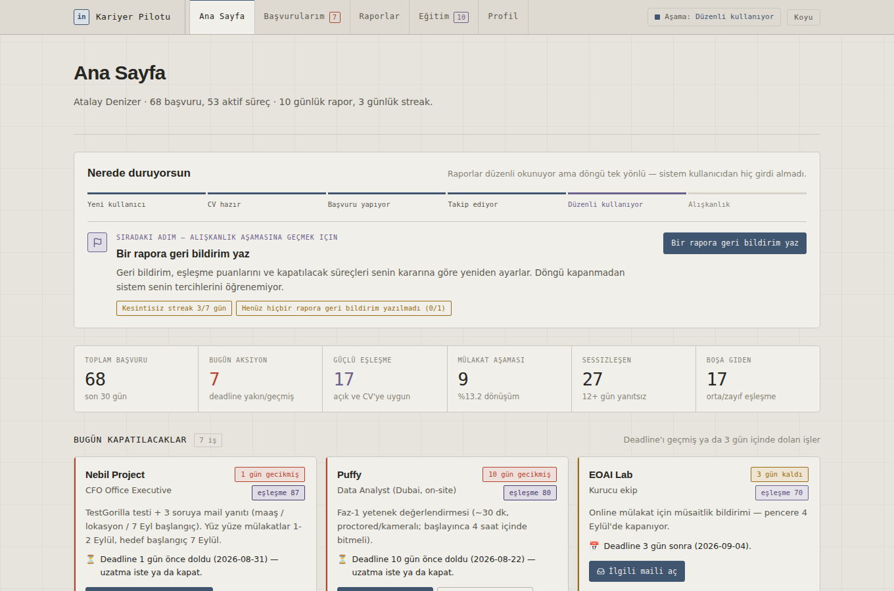
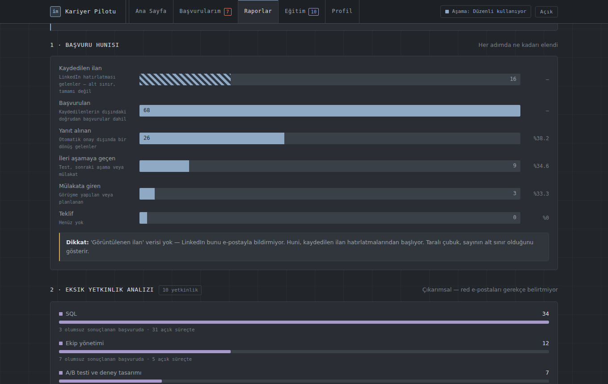
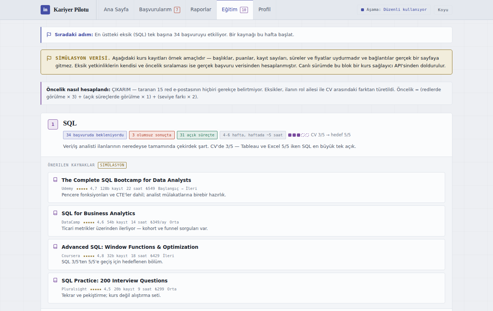
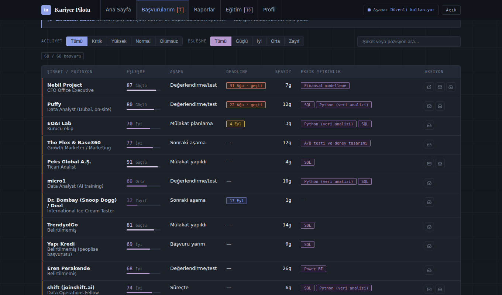
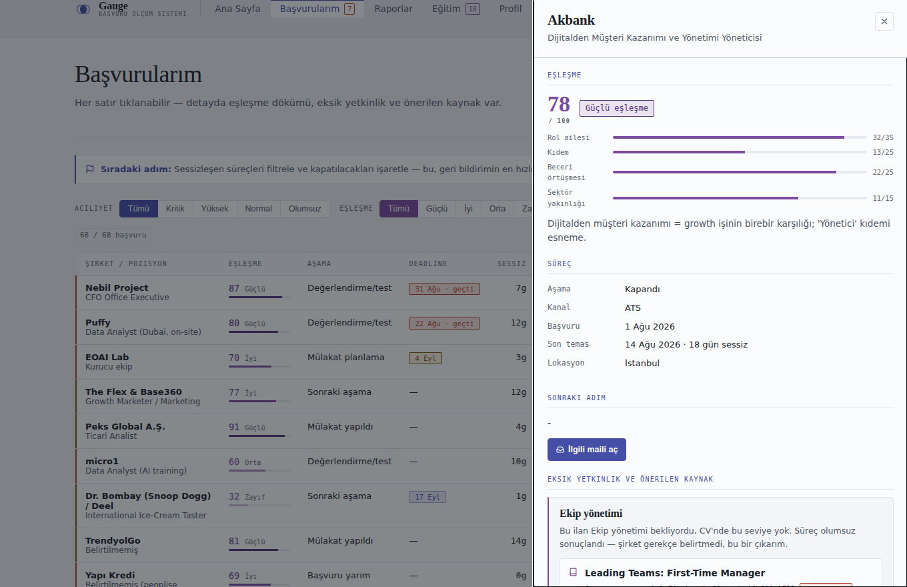

<div align="center">

# Kariyer Pilotu

**Gmail'i tarayıp iş başvurularını tek yerde toplayan, her ilanı CV'ye göre puanlayan
ve eksik yetkinlikleri çıkaran otomasyon.**

30 günlük gerçek bir iş arama sürecinin verisi üzerine kuruldu — 68 başvuru, 8 rapor, 5 sayfalık arayüz.

[**Tanıtım sitesi →**](https://claude.ai/code/artifact/d2716dab-39df-4e8c-b18f-a0d7a01844c3) · [**Canlı demo →**](https://claude.ai/code/artifact/5fdd1d5d-7ec7-40b7-b0b6-6ebeea8e28bc) · [Teknik doküman](docs/TEKNIK.md)

</div>



---

## Ne yapıyor

Bir ayda 68 başvuru yapıldığında hangisinin nerede olduğu, hangi testin süresinin dolduğu
ve hangi sürecin sessizce öldüğü takip edilemiyor. Bu sistem üç soruyu yanıtlıyor:

| Soru | Nasıl yanıtlıyor |
|---|---|
| **Bugün ne yapmalıyım?** | Deadline'ı geçmiş/yaklaşan işleri, sessizleşen süreçleri ve mülakat sonrası takipleri kural tabanlı çıkarır |
| **Enerjimi nereye harcamalıyım?** | Her ilanı CV'ye karşı 0–100 puanlar, dört segmente ayırır ve segmentlerin gerçek ilerleme oranını gösterir |
| **Neyi öğrenmem gerekiyor?** | İlanların beklediği ama CV'de olmayan yetkinlikleri toplar, öncelik sırasına dizer ve eğitim planına çevirir |

**Aciliyet ve eşleşme ayrı iki eksendir.** Zayıf eşleşmeli bir ilanın deadline'ı da acil olabilir;
sistem ikisini ayrı kolonlarda gösterir ve kararı kullanıcıya bırakır.

---

## Veriden çıkan dört bulgu

Sistem kurulduğunda ortaya çıkanlar — hepsi taranan Gmail kutusundan gelen gerçek sayılar:

<table>
<tr><td width="120"><h3>7 / 15</h3></td><td>
<b>Redlerin çoğunluğu kıdem açığından.</b> SQL en yaygın eksik (34 başvuruda bekleniyor), ama
olumsuz sonuçlanan 15 sürecin 7'sinde eksik olan <b>ekip yönetimi</b>. Sorun teknik beceri değil,
Manager/Lead ilanlarına yapılan başvurular — kurs alarak değil hedef bandını değiştirerek çözülür.
</td></tr>
<tr><td><h3>%25</h3></td><td>
<b>Eforun dörtte biri zayıf eşleşmeye gitmiş.</b> 68 başvurunun 17'si orta veya zayıf eşleşme.
Güçlü segmentin ileri aşamaya geçme oranı %18,2.
</td></tr>
<tr><td><h3>88</h3></td><td>
<b>En iyi eşleşme, başvurulmadan süresi doldu.</b> Kaydedilen 16 ilanın 12'sine hiç başvurulmamış.
Michael Page'in FP&A Analyst ilanı 88 puanla listenin en güçlüsüydü ve 20 Ağustos'ta kapandı.
</td></tr>
<tr><td><h3>10 gün</h3></td><td>
<b>Şirketlerin medyan yanıt süresi.</b> 42 başvuru ise hiç yanıtlanmadı. Bu iki sayı,
"12 gün sessizlikten sonra takip maili at" kuralının eşiğini belirledi.
</td></tr>
</table>

---

## Nasıl çalışıyor

```
Gmail taraması  →  sınıflandırma  →  puanlama  →  rapor + hatırlatma
   (her sabah        (teklif/davet/    (aciliyet     (e-posta + pano)
    09:00 TSİ)        red/inceleme)     + eşleşme)
```

**Aciliyet puanı** — bugün neyin kapatılması gerektiği:

```
puan = aşama_ağırlığı + (uyum × 4) + deadline_aciliyeti − sessizlik_cezası
```

**Eşleşme puanı** — CV ile ilanın uyumu:

```
eşleşme = rol_ailesi(35) + kıdem(25) + beceri_örtüşmesi(25) + sektör(15) − lokasyon_cezası
```

Sonuç dört segmente ayrılır: 🟢 Güçlü (78–100) · 🔵 İyi (62–77) · 🟡 Orta (45–61) · 🔴 Zayıf (0–44).

---

## Arayüz

Beş sayfa, hash yönlendirme, çift tema, çerçeve kullanılmadı — tek HTML dosyası.

| | |
|:--|:--|
| <br>**Raporlar** — huni, eksik yetkinlik, trend, yanıt hızı, streak | <br>**Eğitim** — öncelik sıralı eksikler ve kurs önerileri |
| <br>**Başvurular** — eşleşme, aşama, deadline, aksiyon linkleri | <br>**Detay** — eşleşme dökümü ve eksikliğe özel kurs kartı |

Kullanıcı ölçülebilir kriterlerle altı aşamalı bir hattın üzerinde konumlanır
(yeni kullanıcı → CV hazır → başvuru yapıyor → takip ediyor → düzenli kullanıyor → alışkanlık),
ve her sayfa aşamaya göre farklı bir "sıradaki adım" gösterir.

---

## Çalıştırma

Harici bağımlılık yok — yalnızca Python 3.11+ standart kütüphanesi.

```bash
python3 src/pipeline.py                 # bugünün raporu (Markdown)
python3 src/pipeline.py --format csv    # Sheets'e aktarılabilir tablo
python3 src/match.py                    # CV eşleşme özeti ve segmentler
python3 src/insights.py                 # sekiz raporun tamamı
python3 src/build_dashboard.py          # HTML arayüzü üret → reports/pano.html
```

---

## Mimari

```
data/                          Tek doğruluk kaynağı (JSON)
├── applications.json          68 başvuru + eşleşme boyutları + eksik yetkinlikler
├── profile.json               CV'den türetilmiş profil — eşleşmenin referansı
├── skills_catalog.json        Beceri → kaynak eşlemesi (eğitim önerilerinin tek kaynağı)
├── journey.json               Yaşam döngüsü aşamaları ve sayfa yönlendirmeleri
├── engagement.json            Gerçek kullanım kaydı (streak hesabı)
└── saved_jobs.json            Kaydedilip başvurulmayan ilanlar

src/
├── match.py                   CV ↔ ilan eşleşme motoru ve segmentasyon
├── pipeline.py                Önceliklendirme, hatırlatma, rapor (md/text/csv/json)
├── insights.py                Sekiz rapor ve eğitim planı üreticisi
├── build_dashboard.py         Şablona veri enjeksiyonu
└── dashboard.template.html    Arayüz şablonu

site/                          Tanıtım sitesi (GitHub Pages)
config/rules.yaml              Gmail sorguları, sınıflandırma, puanlama, hatırlatmalar
```

Detaylı formüller, bakım notları ve tasarım kararları: **[docs/TEKNIK.md](docs/TEKNIK.md)**

---

## Bilinçli sınırlar

Bu bölüm projenin ne yapmadığını da söylediği için burada duruyor.

**Red gerekçeleri ölçülemiyor.** Taranan 15 red e-postasının hiçbiri sebep belirtmiyor —
hepsi standart kalıp metin. Eksik yetkinlikler bu yüzden şirketlerin söylediği değil,
ilan ile CV arasındaki farktan **çıkarılan** tahminlerdir ve arayüzün her yerinde böyle etiketlenir.

**Görüntülenen ilan verisi yok.** LinkedIn bunu e-postayla bildirmiyor. Huni "kaydedilen ilan"dan
başlar ve yalnızca hatırlatma gönderilenleri kapsar; taralı çubukla alt sınır olarak işaretlenir
ve ondan sonraki dönüşüm oranı hesaplanmaz.

**Kurs kayıtları simülasyondur.** Başlık, puan, süre ve fiyat örnek amaçlıdır; bağlantılar gerçek
sayfa açmaz. Eksik yetkinliklerin kendisi ve öncelik sıralaması gerçek veriden hesaplanır.

**Eşleşme boyutları elle atanıyor.** İlan metninin çekilip beceri çıkarımının otomatikleşmesi
açık madde olarak duruyor.

---

<div align="center">
<sub>Atalay Denizer · <a href="https://linkedin.com/in/atalaydenizer">LinkedIn</a> · Veri penceresi: 1 Ağustos – 1 Eylül 2026</sub>
</div>
